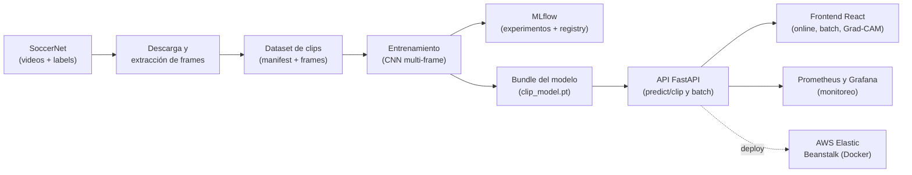
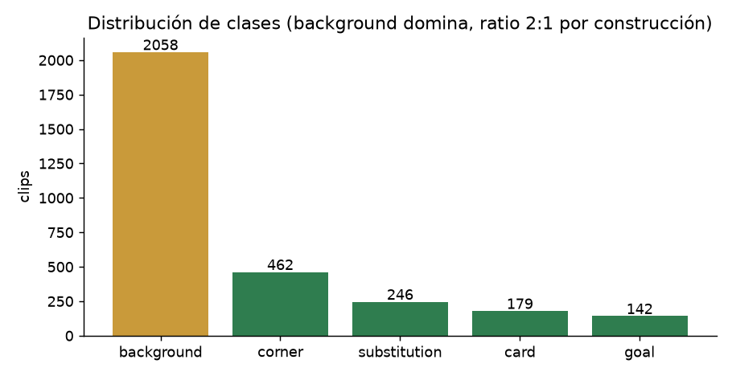
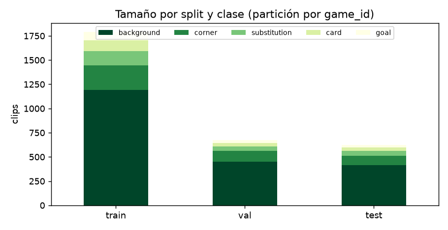
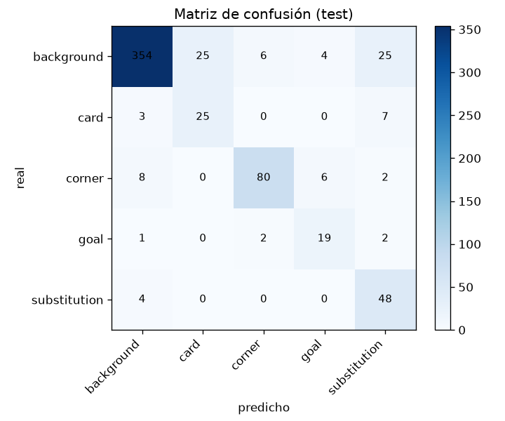
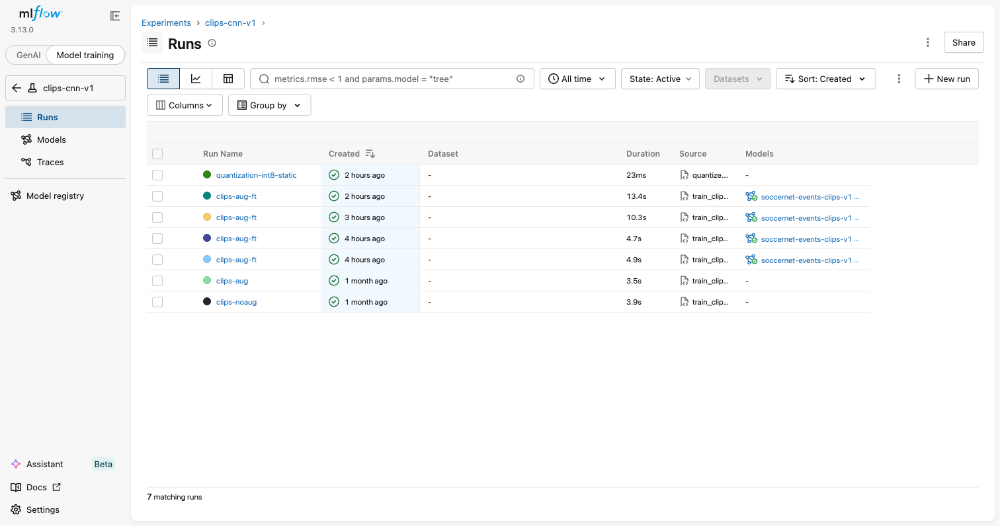
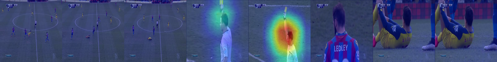
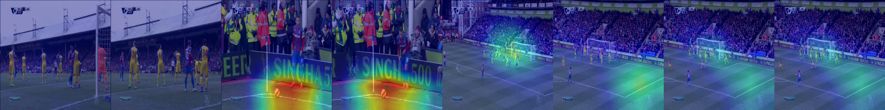
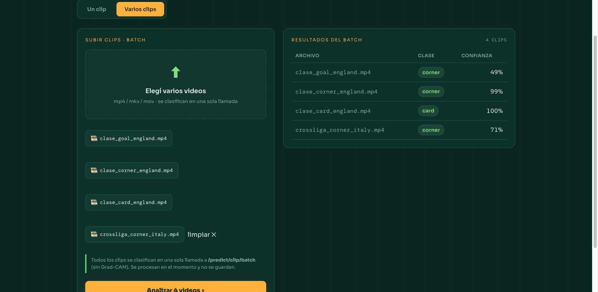
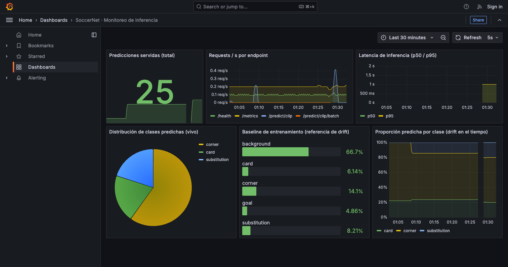
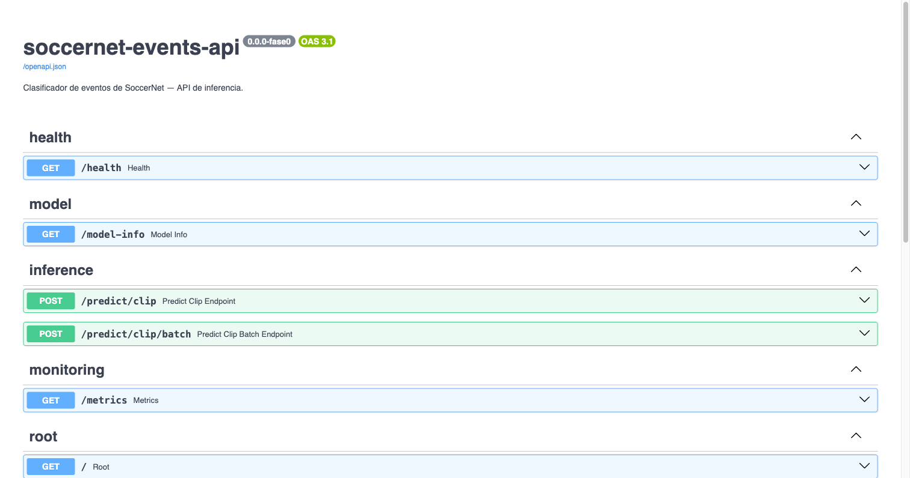

# Clasificador de eventos de fútbol a partir de clips de video

### Obligatorio de Machine Learning en Producción

Máster en IA, Universidad ORT Uruguay

Integrantes:
- Bruno Dinello (192158)
- Germán Otero (138796)
- Carlos Dutra da Silveira (342909)

Repositorio: `github.com/ORTMLProd/obligatorio-dinello-otero-dutradasilveira`

---

## 1. Introducción y problema

Para este obligatorio armamos un sistema de Machine Learning de punta a punta que mira un clip de video de un partido de fútbol y dice qué está pasando. En concreto, clasifica cada clip en uno de cinco tipos de evento: gol, tarjeta, sustitución, córner o "background" (o sea, juego sin un evento destacado).

El target lo definimos nosotros. Nos pareció un problema lindo porque combina lo visual (los frames del video) con la dinámica del partido, y porque tiene los dolores de cabeza típicos de un sistema real: clases muy desbalanceadas, riesgo de que el modelo aprenda atajos tramposos, y la necesidad de servir predicciones online y en lote.

Los datos salen de SoccerNet, un dataset de partidos de fútbol. Los videos están protegidos por copyright y los conseguimos bajo un acuerdo de confidencialidad (NDA) con KAUST, así que manejamos una política de datos estricta que explicamos más abajo.

Una aclaración de arranque que nos marcó todo el trabajo: la consigna prioriza el desarrollo end-to-end por encima del rendimiento del modelo. Con eso en mente, primero cerramos el ciclo completo (datos, modelo, API, frontend, monitoreo y deploy) y recién después fuimos mejorando cada pieza.

### Arquitectura general

Todo el stack (API, frontend, MLflow, Prometheus y Grafana) corre con Docker Compose, y lo desplegamos en AWS Elastic Beanstalk.

### Entorno y versionado

Separamos las dependencias de desarrollo y de producción. En el `pyproject.toml`, las librerías que la API necesita para servir van por un lado, y las de desarrollo, entrenamiento y análisis (tests, MLflow, notebooks, descarga de datos) quedan en grupos aparte. Así la imagen de producción queda liviana, con lo justo para inferir. Y todo corre sobre Docker, tanto en local (un `docker compose` levanta los cinco servicios) como en el deploy.

El código lo versionamos con Git desde el arranque, trabajando con una rama principal y ramas por funcionalidad que integramos con pull requests. El repositorio completo está en GitHub, en el link del encabezado.

---

## 2. Dataset y análisis exploratorio

### Cómo son los videos

SoccerNet trae la transmisión de televisión de cada partido, es decir el broadcast tal cual salió al aire, en baja resolución (224p) y separado en dos videos, uno por tiempo. No es una cámara táctica fija, es la filmación de TV, con sus cortes, repeticiones, primeros planos y placas gráficas (el marcador, el reloj, el logo del canal). Ese detalle importa, porque lo que ve el modelo incluye todo ese ruido de producción televisiva.

### De partido a clips

Cada partido viene con un archivo de anotaciones que marca, con timestamp, cada evento. Nosotros lo procesamos así.

Por cada evento anotado de las cuatro clases objetivo armamos una ventana de 8 segundos centrada en el momento del evento, y de esa ventana sacamos 8 frames equiespaciados (más o menos uno por segundo). El modelo no ve el video en movimiento, ve esas 8 fotos.

Para el background, como no hay anotaciones de "acá no pasa nada", las fabricamos. Recorremos cada tiempo en una grilla de un segundo y nos quedamos solo con los momentos que están a más de 30 segundos de cualquier evento, para no contaminar el background con el entorno de un gol o un córner. Después submuestreamos a una proporción de dos background por cada evento. No conservamos la proporción natural a propósito, porque si no el background aplastaría a todo lo demás.

Todo esto queda indexado en un manifest, que es simplemente un archivo parquet (una tabla) que hace de índice del dataset. Cada fila es un clip de entrenamiento, con su etiqueta (qué evento es), en qué partido y minuto cae, y las rutas a sus 8 frames en el disco. El entrenamiento lee ese índice para saber qué frames cargar y con qué etiqueta.

### El subconjunto y la corrección del sesgo

Arrancamos con 16 partidos de la Premier League para cerrar el ciclo rápido. Cuando lo miramos de cerca nos dimos cuenta de un problema de representatividad: los 16 partidos eran todos de la misma liga, y Chelsea aparecía en la mitad de ellos. Esto no fue casualidad, la lista de partidos de SoccerNet viene ordenada por liga y por equipo, y como tomábamos los primeros 16 de esa lista, nos caían todos juntos de la Premier y con mucho Chelsea. Un modelo entrenado así corre el riesgo de aprender cómo se ve un partido del Chelsea en vez de aprender los eventos.

Lo corregimos escalando a 44 partidos de 6 ligas (Premier League, LaLiga, Champions League, Serie A, Bundesliga y Ligue 1). Además de darle más ejemplos a las clases minoritarias, esto hace que el conjunto de test incluya partidos de ligas que el modelo nunca vio en entrenamiento, así que ahora medimos generalización de verdad y no solo partidos nuevos de equipos conocidos.

### Hallazgos del EDA

El desbalance es fuerte. El background es alrededor de dos tercios de las ventanas. Esto nos obliga a reportar precision, recall y F1 por clase, y nunca accuracy a secas, porque un modelo que dijera siempre background acertaría muchísimo sin servir para nada. En el entrenamiento usamos cross-entropy ponderada por la frecuencia de cada clase.

Las clases minoritarias son gol y tarjeta, con pocas decenas de ejemplos en test. Por eso las métricas por clase de esas dos son más ruidosas, y es una limitación honesta del tamaño del subconjunto. Escalar de 16 a 44 partidos aumentó mucho los ejemplos de esas clases.

El notebook completo del EDA está en `backend/notebooks/eda.ipynb`, y solo consume desde el código de `src/` y los artefactos versionados, sin reimplementar lógica de datos.

---

## 3. Los desafíos: data leakage y training-serving skew

Estos dos son los desafíos generales que pide la consigna, y les pusimos mucho cuidado porque son los que hacen que un modelo se vea bien en la evaluación y después se caiga en producción.

### Prevenir data leakage

El leakage es cuando información que el modelo no tendría disponible al momento de predecir se filtra en el entrenamiento e infla las métricas. Lo atacamos por dos lados.

Los splits son siempre por partido. Nunca partimos por ventana o por frame al azar. Si lo hiciéramos, ventanas del mismo partido caerían en train y en test, y como comparten cancha, camisetas, cámara y hasta el mismo gol filmado desde ángulos parecidos, el modelo reconocería el partido en lugar de aprender el evento. La asignación de splits vive en un manifest versionado (`configs/splits.yaml`) y la blindamos con un test de regresión que verifica que ningún partido cruce de un split a otro. Es el test más importante del proyecto y está en `backend/tests/test_leakage.py`.

El background se muestrea lejos de los eventos. Cuando fabricamos las ventanas de background descartamos cualquier momento que esté a menos de 30 segundos de un evento anotado. La razón es que a los pocos segundos de un gol la imagen todavía es de gol (el festejo, la repetición, el saque del medio), y si etiquetáramos ese frame como background le estaríamos enseñando al modelo algo contradictorio, dos imágenes casi iguales con etiquetas opuestas. Los 30 segundos de buffer aseguran que el background sea juego neutro de verdad y no el entorno de un evento.

### Prevenir training-serving skew

El skew es cuando el preprocesamiento en entrenamiento y en producción difieren aunque sea un poco, y el modelo recibe al servir algo distinto a lo que vio entrenando. Lo atacamos de las siguientes formas.

Una única fuente del preprocesamiento. Toda la lógica de features y transforms vive en `src/features/` y en el camino de inferencia, y la importan tanto el entrenamiento como la API. Nunca se reimplementa nada en el lado de serving. La función que corre la inferencia de un clip es la misma en las dos partes.

Guardamos el preprocesamiento junto con el modelo. Antes de entrar a la red, cada frame pasa por transformaciones (redimensionar y normalizar los colores). Los valores que usa esa normalización quedan guardados adentro del propio archivo del modelo. Así, cuando la API carga el modelo, arma exactamente el mismo preprocesamiento con el que se entrenó, no lo calcula de nuevo. De esa forma un frame que entra por la API pasa por el mismo proceso que pasó en entrenamiento, y no hay diferencias que arruinen la predicción.

El contrato de la API es estricto. Definimos con pydantic la forma exacta que tiene que tener cada pedido y cada respuesta. Si a la API le llega un campo que no espera, lo rechaza en vez de intentar procesarlo. Es una red de seguridad contra un input mal formado que, si se colara, podría producir una predicción silenciosamente mala.

---

## 4. El modelo

El modelo de producción es una red convolucional que trabaja sobre varios frames a la vez. Toma los 8 frames del clip, los pasa por una ResNet18 preentrenada en ImageNet, promedia los embeddings de los 8 frames y una cabeza chica devuelve las cinco probabilidades. Es solo visual porque el caso de uso real es subir un clip suelto, que no trae el contexto tabular del partido.

### La evolución de los resultados

Fuimos mejorando el modelo en pasos, y en cada paso elegimos la mejor variante por validación, nunca por test. Elegir por test sería otra forma de leakage. La métrica es macro-F1 sobre el conjunto de test.

| Modelo | Test macro-F1 | Dataset |
|---|---|---|
| ResNet18 congelada (baseline) | 0.640 | 16 partidos (Premier) |
| Fine-tune del último bloque | 0.672 | 16 partidos (Premier) |
| Fine-tune con más datos | 0.714 | 32 partidos (Premier) |
| **Fine-tune con datos cross-liga (final)** | **0.757** | **44 partidos, 6 ligas** |

El salto grande vino de dos decisiones. La primera fue descongelar el último bloque de la ResNet18 para que aprendiera features propias de fútbol en vez de quedarse con las genéricas de ImageNet. Probamos también descongelar dos bloques, pero dio peor validación (overfitting con un dataset chico), así que nos quedamos con uno. La segunda fue sumar datos y, sobre todo, diversificarlos con las otras ligas.

### Métricas por clase

El modelo final llega a 0.757 de macro-F1 en test. Por clase, background y córner andan muy bien, gol y sustitución razonable, y tarjeta es la más floja: tiene recall alto pero precision baja, o sea que sobre-predice tarjetas. Es un resultado esperable del desbalance y del tamaño chico de la clase.

---

## 5. Requerimientos electivos

La consigna pide implementar al menos tres electivos. Nosotros implementamos cuatro, todos apoyados sobre el modelo de imágenes, más un par de extras.

### 5.1 Trazabilidad de ML

Usamos MLflow para versionar experimentos, modelos y datos. Cada corrida de entrenamiento loguea sus parámetros, las métricas por clase, la macro-F1 y la matriz de confusión, y el modelo queda registrado en el Model Registry de MLflow con el nombre `soccernet-events-clips-v1`. Los datos también quedan trazados: el manifest del dataset se versiona con un hash de su contenido, así que sabemos exactamente con qué datos se entrenó cada modelo.

En la captura se ven las corridas del experimento (las de backbone congelado, las de fine-tune y la de quantization), cada una con sus parámetros y métricas, y enlazadas a la versión del modelo en el registry.

### 5.2 Optimización de modelos

Acá implementamos dos sub-técnicas, las dos con impacto medido, como pide la consigna.

Data augmentation de imágenes. Entrenamos el modelo dos veces, una sin augmentation y otra con recortes, espejados y variaciones de color, y medimos la diferencia. El augmentation subió la macro-F1 de test, y ese delta quedó logueado en MLflow.

Quantization int8 del backbone. Cuantizamos la ResNet18 a enteros de 8 bits con post-training static quantization, y medimos el impacto en tres dimensiones.

| | macro-F1 | Tamaño | Latencia p50 |
|---|---|---|---|
| FP32 (original) | 0.757 | 44.8 MB | 106 ms |
| int8 (quantizado) | 0.757 | 11.2 MB | 306 ms |

El resultado es honesto y con matices. La quantization reduce el tamaño del modelo casi cuatro veces sin perder nada de accuracy, pero en nuestra máquina de desarrollo (Apple Silicon, backend qnnpack) la latencia empeora, porque ahí no hay kernels int8 optimizados. La lección es que el impacto de la quantization depende del hardware.

### 5.3 Explicabilidad

Aplicamos Grad-CAM sobre los frames para ver qué región de cada imagen usó el modelo para su predicción. La idea es entender si mira lo que miraría una persona o si se agarra de un atajo raro.

Al principio los mapas de calor mostraban manchas sin mucho sentido. Diagnosticamos dos causas. Una es de fondo, con un backbone poco adaptado la localización siempre es difusa. La otra era un artefacto de presentación, normalizábamos cada frame por separado y eso estiraba el ruido de los frames sin señal. Lo arreglamos normalizando de forma compartida sobre todo el clip, así los frames que el modelo casi no usó quedan apagados.

Con el modelo final los resultados quedaron bastante interpretables. En un clip de tarjeta, el foco de calor cae justo sobre el brazo del árbitro con la tarjeta en alto.

En un clip de córner, resalta la zona del tiro de esquina y después la acción en el área.

Son la evidencia de que el modelo aprendió features que tienen sentido para una persona, y no correlaciones espurias. Aclaración sobre estas dos figuras: las incluimos con fines ilustrativos y académicos. Los frames crudos de SoccerNet no se versionan en el repositorio por la política de datos.

### 5.4 Visualización

Armamos un frontend en React para interactuar con el modelo. Tiene dos modos. En el modo un clip se sube un video y se obtiene la clase predicha, las barras de probabilidad por clase y el overlay de Grad-CAM frame a frame. En el modo varios clips se suben varios videos de una vez y se obtiene una tabla con la predicción de cada uno.

Elegimos React en vez de Streamlit o Gradio (las herramientas que sugiere la consigna) porque nos daba más control sobre la experiencia y porque el frontend queda como un servicio más del stack.

### 5.5 Extra: monitoreo con Prometheus y Grafana

Un modelo en producción no alcanza con dejarlo corriendo, hay que poder ver qué está haciendo. Montamos una pila de monitoreo clásica de tres capas. La API instrumenta cada request y cada predicción, loguea los inputs y outputs de inferencia de forma anonimizada (sin guardar imágenes) y publica contadores e histogramas en el endpoint `/metrics`. Prometheus scrapea ese endpoint cada pocos segundos y guarda la serie temporal. Y arriba de Prometheus corre un dashboard de Grafana que arma la foto completa del servicio.

El dashboard muestra el total de predicciones servidas, los requests por segundo por endpoint, la latencia de inferencia (percentiles p50 y p95), la distribución de las clases que va prediciendo el modelo en vivo, y un control de drift.

El control de drift compara la distribución de clases del entrenamiento (que publicamos como línea base) contra la distribución de lo que el modelo va prediciendo en producción. Si esas dos cosas empiezan a separarse mucho, es una señal de que los datos que llegan cambiaron respecto a los de entrenamiento, y de que quizá haya que revisar o reentrenar el modelo.

---

## 6. API y contrato

La API está hecha con FastAPI y expone estos endpoints:

- `POST /predict/clip` para inferencia online. Recibe un video, muestrea los frames y devuelve la clase, las probabilidades y el overlay de Grad-CAM.
- `POST /predict/clip/batch` para inferencia en lote. Recibe varios videos y devuelve una lista alineada de resultados, sin Grad-CAM (calcularlo por cada frame de cada clip sería demasiado pesado en volumen).
- `GET /health`, `GET /model-info` (versión y macro-F1 del modelo cargado) y `GET /metrics` en formato Prometheus.

La documentación Swagger se genera automáticamente y cuidamos las descripciones y los ejemplos de los schemas. Los schemas de pydantic son el contrato estricto de la API, con validación que rechaza campos desconocidos, y los mismos tipos respaldan la inferencia online y la batch.

---

## 7. Deploy en AWS

Desplegamos todo el stack en AWS Elastic Beanstalk usando su plataforma Docker, que corre el mismo `docker compose` que usamos en local, en una instancia EC2. Las imágenes de la API y el frontend se buildean y se suben a ECR, y el modelo entrenado se hornea dentro de la imagen de la API, porque la carpeta de modelos está fuera del control de versiones por el NDA y en Elastic Beanstalk no hay un host donde montarla.

La cuenta que usamos es de AWS Academy (un Learner Lab), que tiene sus limitaciones: no deja crear roles de IAM y las credenciales expiran cada pocas horas. Tuvimos un problema en la primera ejecución, donde la instancia quedó sin arrancar. Lo diagnosticamos sin abrir SSH, usando AWS Systems Manager para ver el estado real de la máquina, y confirmamos que el bootstrap había muerto justo en la ventana en que las credenciales del lab se cancelaron. Terminamos la instancia para que el Auto Scaling Group lanzara una de reemplazo, que arrancó limpia. Al final el entorno quedó funcionando de punta a punta, verificado con requests reales a los cinco servicios.

Al momento de escribir esto el entorno sigue en pie, así que el frontend se puede probar en vivo en http://soccer-net-prod.eba-cyqdfnnq.us-east-1.elasticbeanstalk.com.

---

## 8. Trade-offs, alternativas y limitaciones

Esta sección junta las decisiones donde hubo que elegir, con lo bueno y lo malo de cada una.

El baseline tabular que cerró el ciclo. Al principio tuvimos un modelo más simple, un XGBoost sobre features ResNet pre-extraídas por SoccerNet combinadas con las features tabulares. Nos sirvió para cerrar el ciclo end-to-end rápido y sin depender del NDA, pero no es el producto: no puede correr sobre un clip subido, porque necesita features que no se pueden reproducir desde los píxeles. Una vez que el modelo de video estuvo maduro, sacamos ese baseline del repositorio para que quede una sola cosa coherente. Fue una decisión de prolijidad.

El número puede engañar. Ese baseline daba una macro-F1 más alta que la red convolucional, pero estaba inflada por atajos de construcción del dataset (las filas de background tenían valores en lo tabular que las hacían triviales de separar). La red da más bajo pero es más honesta, porque aprende de los píxeles. Es un buen ejemplo de por qué reportamos siempre por clase.

Limitaciones que asumimos. Nuestro dataset es chico, así que las métricas de las clases minoritarias son ruidosas. La clase sustitución es difícil porque su señal visual (el cartel del cuarto árbitro) no siempre está en pantalla en el momento anotado. Y hay un pequeño desfase temporal entre entrenamiento (ventanas de 8 segundos centradas en el evento) y serving (un clip subido de mayor duración, del que muestreamos frames a lo largo de todo el clip), que puede hacer que un evento breve como un gol quede fuera de foco.

También probamos otros caminos en el entrenamiento y en la quantization que no mejoraron los resultados.

---

## 9. Oportunidades de mejora

Entendemos que el proyecto en general tiene muchas oportunidades de mejora, que dado lo acotado del obligatorio no llegamos o no pudimos explorar.

Mejorar el modelo con más y mejores datos. El subconjunto de 44 partidos es chico. Escalar a más partidos y más ligas, cuidando siempre la diversidad, es probablemente lo que más rinde para las clases minoritarias. También se podría balancear mejor la cantidad de ejemplos por liga.

Usar un modelo de video. Hoy nuestro enfoque es sacar 8 frames del clip y pasarlos por una ResNet de imágenes, promediando los resultados. Es simple y liviano, pero pierde el orden temporal y el movimiento. Una alternativa natural sería usar un modelo pensado directamente para video (una CNN 3D o un video transformer) que procese la secuencia completa y capte la dinámica, por ejemplo el desarrollo de un córner o la carrera previa a un gol. Lo dejamos como mejora porque es más pesado de entrenar y de servir, y nuestra prioridad era cerrar el ciclo con algo que anduviera bien en CPU.

Cerrar el desfase temporal entre entrenamiento y serving. Podríamos alinear mejor cómo se muestrean los frames en un clip subido con cómo se arman las ventanas en entrenamiento, para no perder el instante del evento.

Un pipeline de reentrenamiento. Ya tenemos el monitoreo de drift. El paso natural que sigue es conectar esa señal a un proceso que dispare un reentrenamiento cuando la distribución se corre demasiado, cerrando el ciclo de vida del modelo. Para las etiquetas que manejamos no sería tan relevante dado que son eventos muy comunes en partidos de fútbol, pero eso no quita que por ejemplo pueda haber un cambio en las reglas que afecte a la distribución de los datos.

Inferencia batch asíncrona. Hoy el batch es síncrono. Para volúmenes grandes convendría procesarlo en segundo plano y devolver un identificador para consultar el resultado después.

---

## 10. Uso de herramientas de IA generativa

Para este trabajo usamos Claude Code como asistente de programación. Lo usamos en varias etapas: para pensar el alcance, para generar código siguiendo desarrollo guiado por tests, para orquestar las corridas reales (descargas, reconstrucción del dataset, entrenamientos), para diagnosticar problemas de infraestructura, y para depurar la redacción de este informe.

Nosotros tomamos todas las decisiones de dirección (qué problema resolver, cómo construir el dataset, qué modelo usar, cuándo diversificar los datos, qué electivos priorizar) y validamos cada resultado antes de darlo por bueno.
